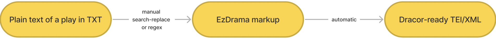

# What is EzDrama

EzDrama format is a Markdown-like (or YAML-like) markup language that serves as intermediary between bare txt and TEI/XML that is ready to put on dracor.org



## Motivation and Aim:

Plain text plays are usually not uniform enough to be converted to TEI fully automatically. With EzDrama you can manually (or semi-automatically, with simple replaces and regex; or by asking GPT to do that, that also works if you whow examples in the prompt) add some uniformity without bothering with heavy-weight XML markup. To find out how to do it and how it works check **Syntax** and **Example** below. 

## Head-on start (if you already know what to do!)
Use this [Colab Notebook](https://colab.research.google.com/drive/1RNvRfTUt9ZDSbqS_nXQxzWH9L2GYr48f?usp=sharing) to convert your play into TEI. That's the easiest way. No coding skills needed. Just click buttons. 

Alternatively, you can try [this basic web-app](https://ezdrama.eu.pythonanywhere.com/) (warning, alpha-version, might break)

## Syntax:

### 1. Play text

Lines are tagged by special symbols at the beginning:

`#` means first level div (e.g. Act 1)

`##` means second level div (e.g. Scene 1)

`###` means third level div... (technically the number of nesting levels is not limited)

`$` means **new stage direction**. NB:  brackets like this `()` are converted to stage directions automatically and do not require any special treatment with metasymbols. In case you don't want brackets to be treated as metasymbols, initialize Parser with `bracketstages = False` (this parameter is True by default)
NB 2: the $ will also put into the current stage tag all next lines before any new metasymbol! E.g. 

```
$ Come John.
He unsheats a sword.
@John:
```

will create a stage direction
```
<stage>Come John. He unsheats a sword.</stage>
```

**If you need a short inside-sp stage, use `%`**:

`%` means single-line stage direction (only works inside sp):

```
@Egg: 
%singing
Wonderful Spam!
```

will turn into

```
<sp who="#egg">
  <speaker>Egg:</speaker>
  <p><stage>singing</stage> Wonderful Spam!</p>
</sp>
```

`@` means the **line contains `<speaker>`** appearance (possibly with inner stage direction in brackets). This will create an `<sp>` tag with a `<speaker>` inside it and then it will put all the following unmarked lines in the file inside that `<sp>` as character speech

any other line without these special symbols will be treated as direct speech of the last encoded speaker (`@`)

NB: dots, colons and such punctuation marks coming right after the <speaker> name will be stripped from the id reference in the `who` attribute automatically. So `@Hamlet.` will сonvert to `<sp who="hamlet"><speaker>Hamlet.</speaker> ... </sp>`

`~` means this and next untagged lines (until the next `~`) within this speech will switch the boolean 'prose/verse mode' to opposite from the main (if the whole play is set to prose, the lines after `~` will be poetic text and will be encoded in `<l>`-s instead of a `<p>`; and vice versa; the main mode is set as the boolean 'is_prose' parameter of the Parser object). the next `~` will switch it back to original mode/ 

`^` means this and next untagged lines are all part of the `<castList>` (and will be encoded as `<castItems>`)

### 2. Pagebreaks

any **number (sequence of digits) followed by colon(:) will be converted to a `<pb/>` tag**

```Wonderful 5:Spam!``` will turn into ```Wonderful <pb n="5"/>Spam!```


### 3. XML comments

EzDrama supports commenting out parts of your file. The syntax here is the standard XML/HTML `<!--comment-->` syntax.
But it only works for comments that start at the start of the line. Examples that work:

```@Ham: 
<!-- commented out-->
Lovely Spam!
```
will turn into 
```
<sp who="#ham">
  <speaker>Ham:</speaker>
<!-- commented out-->
  <p>Lovely <pb n="2"/> Spam!  </p>
</sp>
```
Also works **multiline**:

```
@Ham: 
<!-- commented
out
multi
line
-->
Lovely Spam!
```
will turn into 
```
<sp who="#ham">
  <speaker>Ham:</speaker>
<!-- commented out multi line-->
  <p>Lovely <pb n="2"/> Spam!  </p>
</sp>
```

### 4. Metadata

You can also encode some metadata for the header in the same file:

`@author` means the line contains the author of the play (the name can be separated from `@author` by space or not, the spaces will be stripped)

`@title` means the line contains the main title of the play (the title can be separated from `@title` by space or not, the spaces will be stripped)

`@subtitle` means the line contains the subtitle of the play (the subtitle can be separated from `@subtitle` by space or not, the spaces will be stripped)


## Example of the entire pipeline:

Here is a simple example. Suppose you have a txt like this:

```
Ham 
A tragedy
By William S
Dramatis Personae
Ham
Egg
Vikings
Act 1
Scene 1
Ham: Lovely Spam! 
Egg: Wonderful Spam!
Scene 2
Enter Vikings
Ham: Egg, Spam! 
Sausage, and Bacon! 
Vikings (singing):
Spam, Spam,(o!) 
Spam, Spam, (loud) 
Spam, Spam, (quiet) 
Spam, and Spam
The end
```

With EzDrama you manually encode it like this:

```
@title Ham 
@subtitle A tragedy
@author William S
^Dramatis Personae
Ham
Egg
Vikings
#Act 1
##Scene 1
@Ham: 
Lovely Spam! 
@Egg: 
Wonderful Spam!
##Scene 2
$Enter Vikings
@Ham: 
Egg, Spam! 
Sausage, and Bacon! 
@Vikings (singing):
~Spam, Spam,(o!) 
Spam, Spam, (loud) 
Spam, Spam, (quiet) 
Spam, and Spam
$The end
```

And then you automatically get a TEI/XML like this:

```
<TEI xmlns="http://www.tei-c.org/ns/1.0">
  <teiHeader>
    <fileDesc>
      <titleStmt>
        <title type="main">Ham</title>
        <title type="sub">A tragedy</title>
        <author>William S</author>
      </titleStmt>
      <publicationStmt>
        <publisher xml:id="dracor">DraCor</publisher>
        <idno type="URL">https://dracor.org</idno>
        <availability>
          <licence>
            <ab>CC0 1.0</ab>
            <ref target="https://creativecommons.org/publicdomain/zero/1.0/">
              Licence</ref>
          </licence>
        </availability>
      </publicationStmt>
      <sourceDesc>
        <bibl type="digitalSource">
          <name>ENTER SOURCE NAME HERE</name>
          <idno type="URL">ENTER SOURCE URL HERE</idno>
          <availability status="free">
            <p>In the public domain.</p>
          </availability>
        </bibl>
      </sourceDesc>
    </fileDesc>
    <profileDesc>
      <particDesc>
        <listPerson>
          <person xml:id="egg">
            <persName>Egg</persName>
          </person>
          <person xml:id="ham">
            <persName>Ham</persName>
          </person>
          <person xml:id="vikings">
            <persName>Vikings</persName>
          </person>
        </listPerson>
      </particDesc>
    </profileDesc>
    <revisionDesc>
      <listChange>
        <change when="2023-12-22">DESCRIBE CHANGE</change>
      </listChange>
    </revisionDesc>
  </teiHeader>
  <standOff>
    <listEvent>
      <event type="print" when="2023">
        <desc/>
      </event>
      <event type="premiere" when="2023">
        <desc/>
      </event>
      <event type="written" when="2023">
        <desc/>
      </event>
    </listEvent>
    <listRelation>
      <relation active="INSERT" name="wikidata" passive="INSERT"/>
    </listRelation>
  </standOff>
  <text>
    <front>
      <castList>
        <head>Dramatis Personae</head>
        <castItem>Ham</castItem>
        <castItem>Egg</castItem>
        <castItem>Vikings</castItem>
        <castItem>
        </castItem>
      </castList>
    </front>
    <body>
      <div type="act">
        <head>Act 1</head>
        <div type="scene">
          <head>Scene 1</head>
          <sp who="#ham">
            <speaker>Ham:</speaker>
            <p>Lovely Spam!</p>
          </sp>
          <sp who="#egg">
            <speaker>Egg:</speaker>
            <p>Wonderful Spam!</p>
          </sp>
        </div>
        <div type="scene">
          <head>Scene 2</head>
          <stage>Enter Vikings</stage>
          <sp who="#ham">
            <speaker>Ham:</speaker>
            <p>Egg, Spam!</p>
            <p>Sausage, and Bacon!</p>
          </sp>
          <sp who="#vikings">
            <speaker>Vikings:</speaker>
            <stage>(singing)</stage>
            <l>Spam, Spam, <stage>(o!)</stage></l>
            <l>Spam, Spam, <stage>(loud)</stage></l>
            <l>Spam, Spam, <stage>(quiet)</stage></l>
            <l>Spam, and Spam</l>
          </sp>
          <stage>The end</stage>
        </div>
      </div>
    </body>
  </text>
</TEI>
```

Such markup would take some time to produce manually. But with EzDrama you can just produce it semi-automatically with just a handful of `#`-s, `@`-s, `$`-s and linebreaks.

## How do I run the EzDrama parser

Use this [Colab Notebook](https://colab.research.google.com/drive/1RNvRfTUt9ZDSbqS_nXQxzWH9L2GYr48f?usp=sharing) to convert your play into TEI. That's the easiest way. No coding skills needed. Just click buttons. Alternatively, you can try [this basic web-app](https://ezdrama.eu.pythonanywhere.com/) (warning, alpha-version, might break)

Aside from the Colab version mentioned above, there's also an example standalone jupyter notebook [in this repo](ezdramaparser.ipynb). Both use the [same code](parser.py) for easydrama engine.

## EzDrama Syntax Highlight in Notepad++

If your text editor of choice is Notepad++, this [user defined language syntax](https://github.com/dracor-org/ezdrama/blob/main/Npp_ezdrama-UDL.xml) will help you with the markup process. To enable EzDrama syntax highlight in your Notepad++ go to `language > user defined language > define your language > import`, import the [file](https://github.com/dracor-org/ezdrama/blob/main/Npp_ezdrama-UDL.xml), and then restart the program and select it from the Language menu.
